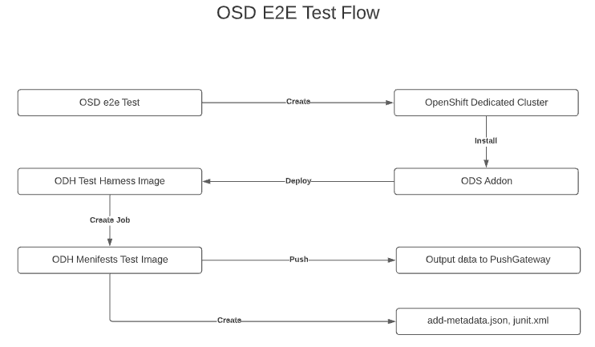

# Jupyterhub Load Test

This test will execute Tensorflow and Pytorch code in Jupyterhub from the ODS(Open Data Scientist) on OSD(OpenShift Dedicated).

This ODH Operator Test Harness will create a job that will deploy odh manifests test image. The odh manifests test image will create a kfdef for Jupyterhub, then it will create Jupyterhubthe with ODS addon on OSD.

## How to test?

- **Pre-requisites**
  ~~~
  git clone https://github.com/Jooho/odh-operator-test-harness.git
  cd odh-operator-test-harness
  make test-setup
  ~~~

- **Update files**
  - Common
    ~~~
    vi template/odh-manifests-test-job.yaml
    - name: PUSHGATEWAY_URL
      value: "$CHANGE_ME"      <== Find a pushgateway url from shorturl.at/DQY49
    ~~~
  
  - With OSD
    ~~~
    vi env.sh
    ODS_NAMESPACE=redhat-ods-applications   <== Uncomment
    #ODS_NAMESPACE=opendatahub              <== Comment out
    
    vi template/odh-manifests-test-job.yaml
    namespace: redhat-ods-applications      <== Uncomment
    # namespace: opendatahub                <== Comment out

    vi hack/odh-operator-test-harness-pod.yaml
    namespace: redhat-ods-applications      <== Uncomment
    # namespace: opendatahub                <== Comment out

    vi pkg/resources/controller.go	
	  OdhNamespace      = "redhat-ods-applications"  <== Uncomment
    // OdhNamespace      = "opendatahub"           <== Comment out
    ~~~

  - With On-prem cluster
    ~~~
    vi env.sh
    ODS_NAMESPACE=opendatahub                <== Uncomment
    #ODS_NAMESPACE=redhat-ods-applications   <== Comment out

    vi template/odh-manifests-test-job.yaml
    namespace: opendatahub                   <== UnComment
    #namespace: redhat-ods-applications      <== Comment out

    vi hack/odh-operator-test-harness-pod.yaml
    namespace: redhat-ods-applications      <== Uncomment
    # namespace: opendatahub                <== Comment out

    vi pkg/resources/controller.go	
    // OdhNamespace      = "redhat-ods-applications"  <== Uncomment
    OdhNamespace      = "opendatahub"                 <== Comment out
    ~~~
  
  - Based on installation status, Update Job Environments variables
    ~~~
     vi template/odh-manifest-test-job.yaml
        - name: SKIP_INSTALL           ==> if you have installed ODH(ODS) and Kfdef and you will use YOUR OWN ID/PW, set TRUE
          value: "TRUE"                 
        - name: SKIP_OPERATOR_INSTALL  ==> if you have installed ODH(ODS) and Kfdef but you will use a DEFAULT ID/PW, set TRUE
          value: "TRUE"
        - name: SKIP_KFDEF_INSTALL    ==> if you have installed ODH(ODS) and Kfdef but you will use a DEFAULT ID/PW, set TRUE
          value: "TRUE"
    ~~~
- **For ODH Manifest Test Job** 

  ~~~
  $ make job-test
  $ make job-test-clean
  ~~~

- **For ODH Test Harness**
  ~~~
  # Update Makefile about the Image registry variable because for test, using your own repository is much easier.
  $vi Makefile
  ...
  DEFAULT_IMAGE_REGISTRY=quay.io
  DEFAULT_REGISTRY_NAMESPACE=jooholee
  DEFAULT_IMAGE_TAG=latest
  ...

  # Build and Push the image
  $ make image

  # Start Test
  $ make cluster-test

  # Check the log
  $ oc logs odh-operator-test-harness-pod -f -c odh
  
  # Clean up test 
  $ make cluster-test-clean

  ~~~